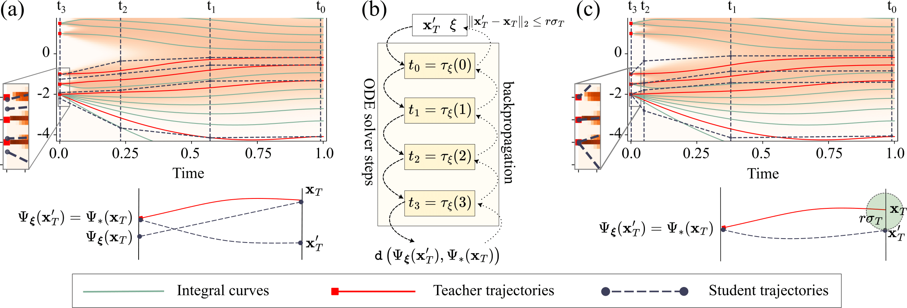

# Learning to Discretize Denoising Diffusion ODEs

🏆 

### [Paper on OpenReview](https://openreview.net/forum?id=xDrFWUmCne)

Implementation of LD3, a lightweight framework designed to learn the optimal time discretization for sampling from pre-trained Diffusion Probabilistic Models (DPMs). LD3 can be combined with various samplers and consistently improves generation quality without having to retrain resource-intensive neural networks. LD3 offers an efficient approach to sampling from pre-trained diffusion models.



## 🔥 Latest News

- **March 2025**: We have successfully applied **LD3** to the **Flux-dev** model and observed promising results.  
- We are releasing the trained time steps for the Flux model soon! Stay tuned for updates.  


## Setup Environment

We will set up the environment using [Anaconda](https://docs.anaconda.com/anaconda/install/index.html). 

```bash
conda env create -f requirements.yml
conda activate ld3
pip install -e ./src/clip/
pip install -e ./src/taming-transformers/
pip install omegaconf
pip install PyYAML
pip install requests
pip install scipy
pip install torchmetrics
```

## Download Pretrained Models and FID Reference Sets

All necessary data will be automatically downloaded by the script. Note that this process may take some time. If you wish to skip certain downloads, you can comment out the corresponding lines in the script.

```bash
bash scripts/download_model.sh
wget https://raw.githubusercontent.com/tylin/coco-caption/master/annotations/captions_val2014.json
```


## 🚀 Generating Training Data for LD3  

Before training **LD3**, we first need to generate training data using the teacher solver. The script `gen_data.py` handles this process. Below is an example of generating training data with **20 sampling steps** for **CIFAR-10**, using the `uni_pc` solver and `time-edm` discretization.  

### 📌 Example: Generating CIFAR-10 Training Data

```bash
CUDA_VISIBLE_DEVICES=0 python3 gen_data.py \
                    --all_config configs/cifar10.yml \
                    --total_samples 100 \
                    --sampling_batch_size 10 \
                    --steps 20 \
                    --solver_name uni_pc \
                    --skip_type edm \
                    --save_pt --save_png --data_dir train_data/train_data_cifar10 \
                    --low_gpu
```
#### 📌 Key Arguments:

- `all_config`: Path to the default configuration file (mandatory). If other arguments are not specified, their values will be taken from this file.
- `solver_name`: Solver to use. Options include `uni_pc`, `dpm_solver++`, `euler`, and `ipndm`.
- `skip_type`: Discretization method. Options include `edm`, `time_uniform`, and `time_quadratic`.
- `low_gpu`: Enables the use of PyTorch's `checkpoint` feature to reduce GPU memory usage.
- `data_dir`: Root directory for saving the generated data. The script will create a subdirectory within this path using the naming format `${solver_name}_NFE${steps}_${skip_type}`.

### 📌 Example: Generating Stable Diffusion Training Data

For Stable Diffusion, you must additionally specify the prompt file and the number of prompts. Below is an example:

```bash
CUDA_VISIBLE_DEVICES=0 python3 gen_data.py \
                    --all_config configs/stable_diff_v1-4.yml \
                    --total_samples 100 \
                    --sampling_batch_size 2 \
                    --steps 6 \
                    --solver_name uni_pc \
                    --skip_type time_uniform \
                    --save_pt --save_png --data_dir train_data/train_data_stable_diff_v1-4 \
                    --low_gpu \
                    --num_prompts 5 --prompt_path captions_val2014.json
```

## Training LD3
After generating the training data, you can train **LD3** using the `main.py` script. Below is an example of training **LD3** on **CIFAR-10** with the following configurations:
- **Teacher**: 20 sampling steps, `uni_pc` solver, and `time-edm` discretization.
- **Student**: 10 sampling steps, `dpm_solver++` solver.

```bash
CUDA_VISIBLE_DEVICES=0 python3 main.py \
                    --all_config configs/cifar10.yml \
                    --data_dir train_data/train_data_cifar10/uni_pc_NFE20_edm \
                    --num_train 50 --num_valid 50 \
                    --main_train_batch_size 1 \
                    --main_valid_batch_size 10 \
                    --solver_name dpm_solver++ \
                    --training_rounds_v1 2 \
                    --training_rounds_v2 5 \
                    --steps 10 \
                    --log_path logs/logs_cifar10
```

**Trained timesteps are available [here](https://docs.google.com/spreadsheets/d/1nUrTDvvtpPHZuRuJcn3zzxGmVKrNX4fFHu8wYIIoGSM/edit?usp=sharing) and are still being updated.**


#### 📌 Key Arguments:

- `data_dir`: The full path to the training data directory (unlike the root directory used during data generation).
- `log_path`: The root directory for saving logs and models. The script will create a subdirectory within this path using the naming format: `${solver_name}-N${steps}-b${bound}-${loss_type}-lr2${lr2}rv1${rv1}-rv2${rv2}`, for example, `uni_pc-N10-b0.03072-LPIPS-lr20.01rv12-rv25`

## FID Evaluation


### ⚠️ Different FID Scores

It is important to note that FID (Fréchet Inception Distance) scores can vary significantly depending on the processing pipeline used. To ensure transparency and reproducibility, our framework provides a script `compute_fid.py` that supports FID evaluation for both EDM and Latent-Diffusion.

### 📌 How FID Evaluation Works

The `compute_fid.py` script is a streamlined version of `gen_data.py` with a few differences:

The `--save_dir`, `--save_pt`, and `--save_png` arguments are ignored because the generated data is directly processed for FID calculation without being saved.

The data is automatically forwarded to the FID computation module to extract features.

### 📌 Example: Computing FID for Stable Diffusion

```bash 
CUDA_VISIBLE_DEVICES=0 python3 compute_fid.py \
                    --all_config configs/stable_diff_v1-4.yml \
                    --total_samples 100 \
                    --sampling_batch_size 2 \
                    --steps 6 \
                    --solver_name uni_pc \
                    --skip_type time_uniform \
                    --low_gpu \
                    --num_prompts 5 --prompt_path captions_val2014.json

```
## Citation 

```
@inproceedings{tong2024learning,
  title     = {Learning to Discretize Denoising Diffusion ODEs},
  author    = {Tong, Vinh and Hoang, Trung-Dung and Liu, Anji and Van den Broeck, Guy and Niepert, Mathias},
  booktitle = {Proceedings of the 13th International Conference on Learning Representations},
  year      = {2025}
}
```

## License
MIT 

